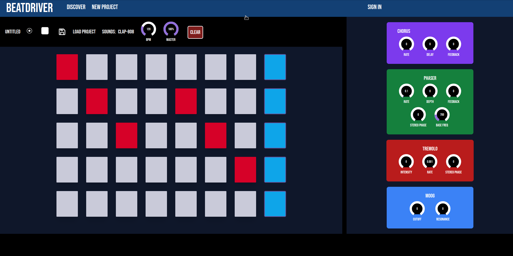

# Beatdriver



Beatdriver is a beginner-friendly music creation tool you can use right in the browser. Create beats with built-in sounds and effects, upload your own samples, and save and record your projects to share with anyone!

## Features

- **User Authentication:** Sign up and sign in with user credentials via Google.
- **Built-in Instruments:** Access a variety of built-in instruments to create different sounds for your project.
- **Adjustable Settings:** Adjust the bpm, volume, and mixer effects of your overall project.
- **MIDI Controller Layout:** Apply different sounds to buttons in a MIDI controller-style layout to create an audio track.
- **Record & Playback:** Record and playback your creation.
- **Save & Share:** Save your creation to your profile if logged in and share it with others.
- **Export as MP3:** Export your creation as an MP3 audio source.
- **Upload Your Own Sounds:** Upload your own instruments or sounds for use in the app.
- **Discover:** View other users' projects on a discovery page and save and edit any public users' track as your own.

## Tech Stack

This application is built with the following technologies:

- [Next.js](https://nextjs.org/)
- [React.js](https://reactjs.org/)
- [Firebase](https://firebase.google.com/)
- [Tailwind CSS](https://tailwindcss.com/)
- [Web Audio API](https://developer.mozilla.org/en-US/docs/Web/API/Web_Audio_API)

## Getting Started

These instructions will get you a copy of the project up and running on your local machine for development and testing purposes.

### Prerequisites

Before you begin, ensure you have installed:

- [Node.js](https://nodejs.org/)
- [npm](https://www.npmjs.com/)

### Installation

1. Clone the repo

```bash
git clone https://github.com/FC-TEAM-VISA/music-collab-app.git
```

2. Navigate to the project directory

```bash
cd music-collab-app
```

3. Install packages

```bash
npm install
```

4. Start the application

```bash
npm run dev
```

## Authors

| Name          | LinkedIn                                            | GitHub                                  |
| ------------- | --------------------------------------------------- | --------------------------------------- |
| Sarah Alli    | [LinkedIn](https://linkedin.com/in/allisarah)       | [GitHub](https://github.com/se7en-illa) |
| Anthony Feliz | [LinkedIn](http://www.linkedin.com/in/anthonyfeliz) | [GitHub](https://github.com/arfgit)     |
| Ida Kamali    | [LinkedIn](https://www.linkedin.com/in/ida-kam/)    | [GitHub](https://github.com/idakam)     |
| Vi Xiang      | [LinkedIn](https://www.linkedin.com/in/vixiang/)    | [GitHub](https://github.com/vx0000)     |
